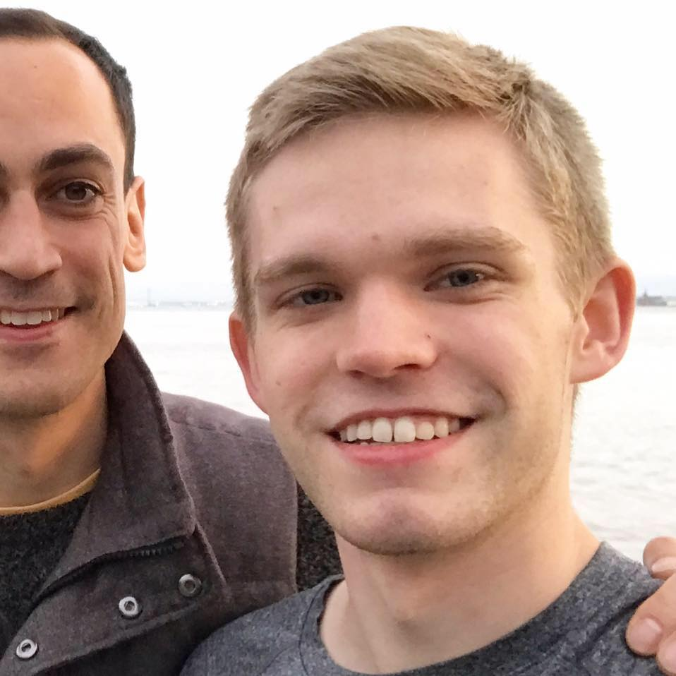

# Copy & Paste Bio
Kyle is a iOS & Software Engineer at Strava - the social network for athletes. He graduated from the University of Rochester with a degree in Computer Science and Psychology.

# Extended Bio
With the announcement of the App Store 2008, I started learning Objective-C and published my first series of iOS apps in 2011 when I was 16 years old.

Currently, I study Computer Science and Psychology under the Hajim School of Engineering & Applied Sciences at the University of Rochester. I will complete a double-major degree this year in December 2017.

This summer, I was a software engineer intern at Strava – the social network for athletes. I was a teaching assistant for University of Rochester's first iOS Swift course in 2016. In 2014, I worked at Instapaper where I helped ship Instapaper 6.0 Instapaper was acquired by Pinterest last year.

I respond to most emails: kylrya@gmail.com

# Work Experience
## Strava
Software Engineer (Jan 2018 - Present)

## Strava
Software Engineer Intern (June 2017 - August 2017)

Athlete & Club Posting: Contributed to bringing posts in the feed to all clubs and users on iOS. Pivotal in executing smooth, elegant, low-friction post creation flows. Primarily worked in Objective-C. (Press Release)

Search Infrastructure: Enhanced club search result quality, accuracy, and relevance. Worked with Scala infrastructure and Elastic Search Cluster.

Production Code: Engaged in numerous code reviews for shipping production code to the Apple App Store

Brand Improvement: Contributed to the outward facing Strava Engineering blog as an intern. Gave a short engineering “tech talk” about Objective-C MVC and delegate patterns.

## University of Rochester - Computer Science
iOS App Programming Teaching Assistant (Sept 2016 - Dec 2017)

Swift Programming: Led review sessions to answer questions about the Swift programming language and iOS development best practices pertaining to the course.

Project Grading: Worked with two other TAs to grade weekly coding assignments, 4 projects, and 2 exams.

## Instapaper (acquired by Pinterest)
iOS Engineering Intern (June 2014 - Aug 2014)

Objective-C: Worked extensively in Objective-C and Storyboards on a code-base without ARC to implement user profiles feature. Optimized product for multi-device and multi-orientation use.

Browse Section: Built the new Browse Section in Objective-C which went live in Instapaper 6.0. ( Press Release)

Cross-Platform: Worked with another intern to facilitate cross-platform feature availability on the Instapaper web-client.

# Education
Bachelor's Degree in Computer Science & Psychology (Double Major)
University of Rochester (Jan 2014 - Present)

- [Twitter](http://twitter.com/rsms) — say hi
- [GitHub](https://github.com/rsms) — code, yummy code
- [Instagram](http://instagram.com/rasmusfabbe/) — short stories
- [Flickr](http://www.flickr.com/photos/rsms/) — archived photos
- [Facebook](http://www.facebook.com/rsms)
